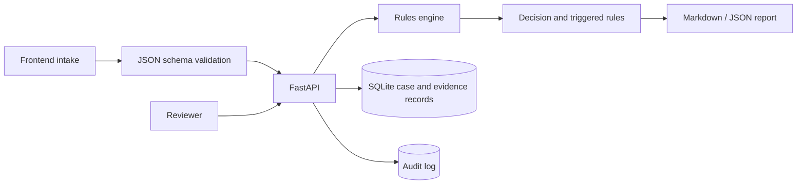

# AI-Generated Actor and Deepfake Content Compliance Assessment

Chinese title: AI生成演员与深度伪造内容合规评估：面向合成媒体平台的授权、标识与治理控制

English title: Compliance Assessment for AI-Generated Actors and Deepfake Content: Consent, Labeling, Privacy Engineering, and Governance Controls for Synthetic Media Platforms

## Project Overview

This project evaluates a fictional AI actor / synthetic media platform that allows creators, brands, and production teams to generate digital performances from real face, voice, motion, video, and consent records. The project now has two layers:

- A product-facing GitHub Pages demo that runs entirely in the browser;
- A FastAPI reference implementation that models canonical intake schema, rule evaluation, SQLite records, reports, role-aware review actions, retention, soft deletion, and audit logs.

The deployed GitHub Pages demo runs client-side. The FastAPI service is a separate engineering implementation using the same case concepts and stricter schema/rule definitions. The deployed web demo does not call the Python backend.

## Quick Links

| Link | URL |
|---|---|
| Compliance repository | <https://github.com/yuxuancheng123-spec/ai-generated-actor-compliance> |
| English GitHub Pages demo | <https://yuxuancheng123-spec.github.io/ai-generated-actor-compliance/web/> |
| Chinese GitHub Pages demo | <https://yuxuancheng123-spec.github.io/ai-generated-actor-compliance/web/demo.zh.html> |
| Final assessment report | [docs/09_final_compliance_assessment_report.md](docs/09_final_compliance_assessment_report.md) |
| Technical architecture | [docs/11_privacy_engineering_technical_architecture.md](docs/11_privacy_engineering_technical_architecture.md) |
| LINDDUN threat model | [docs/12_linddun_threat_model.md](docs/12_linddun_threat_model.md) |
| FastAPI backend | [backend/](backend/) |
| Canonical examples | [examples/](examples/) |
| Static web demo | [web/](web/) |

## Why This Problem Matters

Synthetic actor platforms can create value for short drama production, advertising, performer digital replicas, virtual influencers, and fan content. The same workflow can also enable stolen-face content, unauthorized voice cloning, misleading endorsements, unlicensed training data use, label stripping, and weak incident response.

This project treats the problem as a privacy engineering system, not only as a legal memo. It asks whether the platform can prove who authorized the use, what scope was granted, which rule fired, why the decision was made, and how the evidence is retained for audit or incident response.

## Architecture



## Privacy Engineering Scope

Implemented controls:

| Control | Implementation |
|---|---|
| Consent record | Captures authorizing party, authorized party, purpose, likeness/voice/motion/performance scope, territory, duration, training use, secondary use, revocation, compensation, and evidence status |
| Audit log | Records case creation, assessment completion, review updates, and soft deletion requests |
| Retention and deletion | Tracks `retention_until`, `deleted_at`, `deletion_requested`, and keeps necessary audit records after soft deletion |
| Role-based access | Defines `requester`, `reviewer`, and `compliance_admin`; review and deletion actions require elevated roles |

Prototype boundary:

- Evidence files are referenced, not stored.
- Role checks use an `X-Actor-Role` header for demonstration, not production authentication.
- SQLite is used for local modeling and tests.
- The static web demo remains independent from the backend.

## Threat Model

The project includes a LINDDUN threat model covering:

- Linkability;
- Identifiability;
- Non-repudiation;
- Detectability;
- Disclosure of information;
- Unawareness;
- Non-compliance;
- Forged consent;
- Label stripping;
- Vendor training misuse;
- Insider access.

See [docs/12_linddun_threat_model.md](docs/12_linddun_threat_model.md).

## Data Model

The backend persists:

| Table | Purpose |
|---|---|
| `case_records` | Canonical intake JSON, requester/person type, review status, retention, soft deletion |
| `consent_records` | Scope, purpose, territory, duration, training use, secondary use, revocation, compensation |
| `evidence_records` | Evidence owner, type, URI/reference, verification status, retention date |
| `assessment_results` | Rule version, score, risk level, decision, reviewer path, missing information, report |
| `triggered_rules` | Rule trace with severity, score, hard-stop status, control, and source reference |
| `audit_logs` | Case creation, assessment, review update, report/deletion events |

The canonical case schema is defined in [backend/app/schemas.py](backend/app/schemas.py). Unknown, not provided, unverified, and verified values are separate enum states, so missing fields are not silently treated as `false`.

## Rules Engine

Rules are defined in [backend/app/rules.py](backend/app/rules.py). Each rule includes:

- `rule_id`
- `title`
- `description`
- `severity`
- `score`
- `hard_stop`
- `affected_domain`
- `recommended_control`
- `source_reference`
- `version`

Assessment output includes:

- `total_score`
- `risk_level`
- `decision`
- `triggered_rules`
- `hard_stops`
- `recommended_controls`
- `missing_information`
- `reviewer_path`
- `report_markdown`

Risk levels:

| Condition | Result |
|---|---|
| Any hard stop | `prohibited` + `reject` |
| Score >= 9 | `high` + `manual_review` |
| Score >= 5 | `medium` + `approve_with_conditions`, unless missing information requires review |
| Score < 5 | `low` + `approve`, unless missing information requires review |

Hard stops cannot be offset by low-risk facts.

## API

Implemented endpoints:

| Method | Path | Purpose |
|---|---|---|
| `POST` | `/api/v1/assessments` | Validate case JSON, evaluate rules, persist records, generate audit log |
| `GET` | `/api/v1/assessments/{case_id}` | Return case, latest assessment, deletion state, and audit events |
| `GET` | `/api/v1/assessments/{case_id}/report` | Return Markdown report payload |
| `POST` | `/api/v1/assessments/{case_id}/review` | Reviewer/admin updates review status and notes |
| `DELETE` | `/api/v1/assessments/{case_id}` | Compliance admin soft-deletes a case and records deletion event |

## Local Setup

```bash
cd ai-generated-actor-compliance
python3 -m venv .venv
source .venv/bin/activate
pip install -r requirements.txt
uvicorn backend.app.main:app --reload
```

Open the API docs:

```text
http://127.0.0.1:8000/docs
```

## Tests

Run the backend and script tests:

```bash
pytest
```

The tests cover:

- Authorized performer workflow;
- Unverified consent;
- Public figure commercial endorsement risk;
- Minor or sensitive context;
- Training use without authorization;
- Required field validation;
- Labeling and provenance rules;
- Hard-stop priority;
- Rule trace in reports;
- Assessment audit log;
- Review role checks;
- Retention and soft deletion.

## Example Assessment

Run the CLI wrapper against a canonical JSON case:

```bash
python3 scripts/risk_scoring_demo.py \
  --input examples/unauthorized_public_figure_ad.json \
  --json-output
```

Run with flags:

```bash
python3 scripts/risk_scoring_demo.py \
  --content-type video \
  --real-person true \
  --authorized false \
  --public-figure true \
  --commercial true \
  --sensitive-context none \
  --ai-labeled false
```

Expected trace includes:

```text
R-01 Real-person commercial use without verified authorization +5 HARD STOP
```

Export JSON Schema:

```bash
python -m backend.app.schema_export
```

## Docker

```bash
docker build -t ai-actor-compliance-api .
docker run --rm -p 8000:8000 ai-actor-compliance-api
```

Then open:

```text
http://127.0.0.1:8000/docs
```

## Repository Structure

```text
ai-generated-actor-compliance/
├── backend/
│   └── app/
│       ├── schemas.py
│       ├── rules.py
│       ├── models.py
│       ├── services.py
│       └── main.py
├── docs/
├── examples/
├── frameworks/
├── privacy_engineering/
├── scripts/
├── tests/
└── web/
```

## Limitations

- This is a prototype and not legal advice.
- The rules do not cover every jurisdiction or platform policy.
- Scoring thresholds are transparent but require further validation.
- The API does not implement production authentication, encryption, or media storage.
- GitHub Pages and FastAPI are not deployed as one connected system.

## Future Work

- Connect the static intake UI to the FastAPI service in a local development mode.
- Add encrypted evidence storage and field-level access controls.
- Add complaint intake and affected-person notification APIs.
- Add rule version migration and policy regression tests.
- Add C2PA/content credential verification and export hash registry checks.

## Disclaimer and Contribution Note

This project is fictional and educational. It is designed as a portfolio case study for AI governance, privacy engineering, and synthetic media compliance. It is not legal advice.

The project author designed the scope, risk model, control architecture, rules, tests, and documentation direction. Codex assisted with drafting, implementation, refactoring, and test scaffolding. Final responsibility for the project framing, architecture, rules, documentation, and submitted portfolio artifacts remains with the project author.
