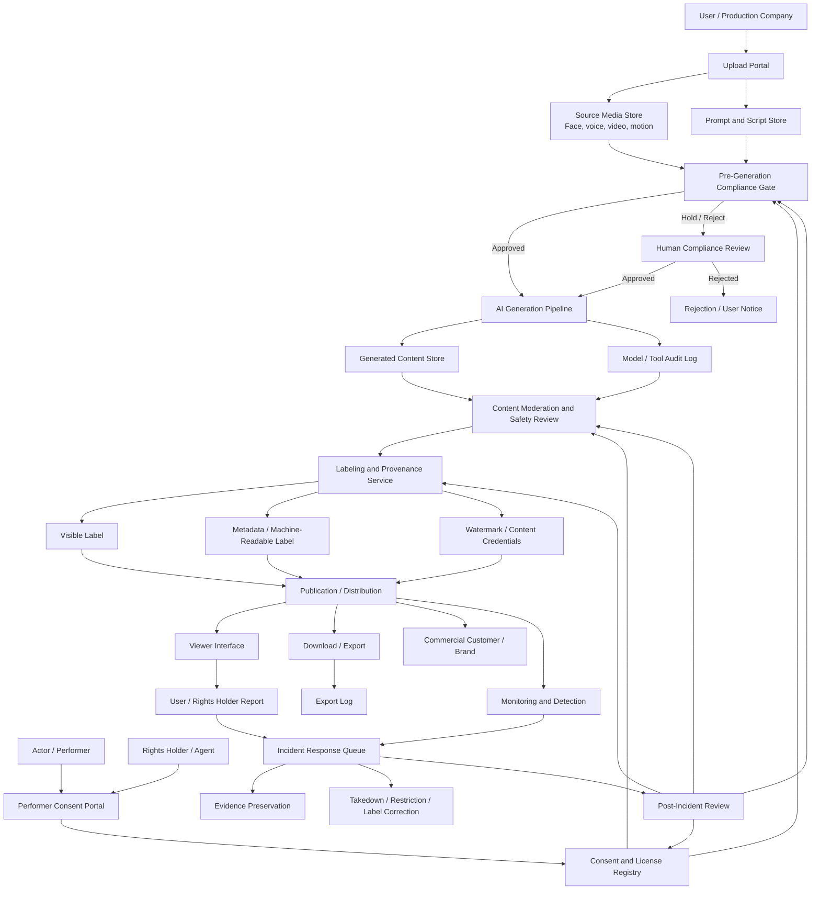

# Data Flow Diagram

## 1. Purpose

This diagram documents how facial images, voice samples, video clips, motion data, consent records, prompts, AI models, generated outputs, labels, and incident records move through the synthetic media platform.

## 2. Mermaid Diagram

## 3. Data Objects

| Data Object | Source | Destination | Key Risk |
|---|---|---|---|
| Facial image | User, performer, production company | Source media store, generation pipeline | Unauthorized likeness use |
| Voice sample | User, performer, production company | Source media store, voice generation pipeline | Unauthorized voice cloning |
| Video clip | User, performer, production company | Source media store, face/body/motion models | Privacy leakage and scope creep |
| Motion data | Performer or production company | Source media store, generation pipeline | Performance reuse beyond license |
| Prompt and script | User or production company | Prompt store, moderation workflow | Defamatory, political, sexual, or misleading portrayal |
| Consent record | Performer, agent, guardian, rights holder | Consent registry, review workflow | Overbroad or forged authorization |
| License metadata | Rights holder, brand, production company | Consent registry, publication gate | Commercial scope violation |
| Generated output | AI generation pipeline | Generated content store, moderation, publication | Misleading synthetic content |
| Label metadata | Labeling service | Content file, export log, audit log | Label removal or reposting |
| Incident report | Viewer, rights holder, internal detector | Incident response queue | Weak complaint mechanism |

## 4. High-Risk Transfer Points

1. Upload to source media store: verify uploader authority and source media provenance.
2. Consent registry to generation gate: ensure consent scope is machine-checkable.
3. Generation pipeline to moderation: link generated output to source media and model log.
4. Labeling service to publication: block publication if required labels are missing.
5. Download/export: preserve visible and machine-readable labels.
6. Incident response: preserve evidence before takedown or label correction.

