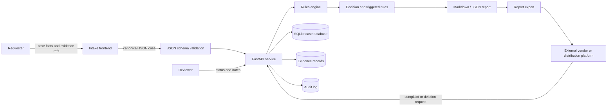

# Privacy Engineering Technical Architecture

This document explains how the prototype translates a synthetic media compliance review into a small privacy engineering system. The deployed GitHub Pages demo remains client-side. The FastAPI backend is a separate reference implementation that uses the same case concepts and a stricter Pydantic schema.

## Architecture Flow

## System Boundary

| Component | What it does | What it does not do |
|---|---|---|
| GitHub Pages demo | Runs the product-style intake and report experience in the browser | Does not call the FastAPI backend |
| Pydantic schema | Defines canonical case fields, enums, unknown states, and JSON Schema export | Does not guarantee legal sufficiency |
| Rules engine | Produces score, risk level, decision, hard stops, missing information, and rule trace | Does not replace human review |
| FastAPI service | Validates cases, evaluates rules, persists records, returns reports, and logs audit events | Does not implement production authentication |
| SQLite database | Stores case JSON, consent records, evidence records, assessment result, triggered rules, and audit logs | Does not represent a hardened production datastore |

## Data Model Summary

| Table | Purpose | Privacy engineering relevance |
|---|---|---|
| `case_records` | Stores canonical intake JSON, person/requester type, review status, retention, and soft deletion state | Maintains the accountable case file |
| `consent_records` | Stores consent status, authorized party, scope, territory, duration, training use, secondary use, revocation, and compensation | Supports purpose limitation and scoped authorization |
| `evidence_records` | Stores evidence owner, evidence type, URI/reference, verification status, retention date, and metadata | Separates evidence references from rule output |
| `assessment_results` | Stores rule version, total score, risk level, decision, reviewer path, controls, missing fields, and report | Makes decisions reproducible |
| `triggered_rules` | Stores every rule that fired with score, severity, hard-stop flag, domain, control, and source reference | Provides rule traceability |
| `audit_logs` | Stores case creation, assessment, review updates, report export, deletion request, and archive events | Supports accountability and non-repudiation |

## Privacy Controls Implemented

| Control | Implementation |
|---|---|
| Consent record | `ConsentRecordInput` and `consent_records` table capture who authorized, who received authorization, purpose, scope, territory, duration, training use, secondary use, revocation, and compensation |
| Audit log | `audit_logs` records case creation, assessment completion, reviewer updates, and soft deletion requests |
| Retention and deletion | `retention_until`, `deleted_at`, and `deletion_requested` event preserve auditability without hard deleting the case |
| Role-based access | `X-Actor-Role` supports `requester`, `reviewer`, and `compliance_admin`; reviewer updates and deletion require elevated roles |

## Decision Logic

| Output | Meaning |
|---|---|
| `total_score` | Sum of scores for all triggered non-blocking and blocking rules |
| `risk_level` | `low`, `medium`, `high`, or `prohibited`; any hard stop forces `prohibited` |
| `decision` | `approve`, `approve_with_conditions`, `manual_review`, or `reject` |
| `triggered_rules` | Full rule trace with score, severity, hard-stop flag, domain, control, and source reference |
| `missing_information` | Unknown, unverified, or not-provided fields that cannot be treated as safe |
| `reviewer_path` | Operational path for standard release, conditional release, enhanced review, or block/incident review |

## Hard Stop Policy

Hard stops cannot be offset by low-risk facts. If a hard-stop rule fires, the decision is `reject` and the risk level is `prohibited`.

Implemented hard stops include:

- Real-person commercial use without verified authorization;
- Real-person sexual or defamatory synthetic portrayal;
- Minor identity in sensitive synthetic-media context;
- Training use without separate authorization.

## Prototype Limitations

- The API uses a role header for demonstration and does not implement production authentication.
- SQLite is used for local evidence modeling, not production security.
- Evidence files are referenced by URI/reference only; this prototype does not store encrypted media.
- Rules are intentionally transparent and deterministic; they need legal, policy, and operational validation before real deployment.
- The deployed GitHub Pages demo is not connected to the backend service.

