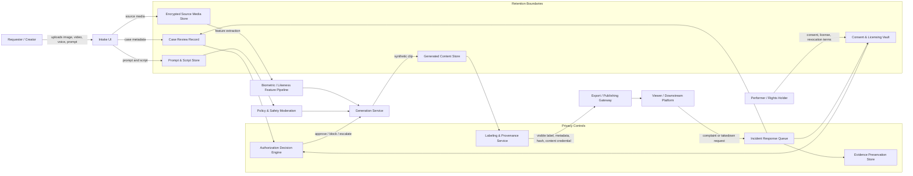

# Privacy Engineering Data Flow Diagram v2

This upgraded data flow diagram focuses on privacy-relevant data movement, control points, retention boundaries, and evidence artifacts for the fictional AI actor / synthetic media platform.

## Key Privacy Control Points

| Control point | Privacy purpose | Evidence artifact |
|---|---|---|
| Intake UI | Capture declared use, source media type, person depicted, regions, and commercial purpose | Intake case JSON |
| Consent & Licensing Vault | Bind face, voice, motion, performance, commercial use, training use, duration, territory, and revocation terms | Consent record, license scope, audit event |
| Authorization Decision Engine | Prevent generation when real-person likeness or voice lacks verified authority | Decision log, reviewer note |
| Biometric / Likeness Feature Pipeline | Minimize extracted identifiers and avoid uncontrolled template reuse | Feature extraction log, deletion job |
| Labeling & Provenance Service | Preserve transparency after publication or export | Visible label, metadata label, hash, content credential |
| Incident Response Queue | Support notice-and-action, takedown, evidence preservation, and control improvement | Incident ticket, evidence package, post-incident review |

